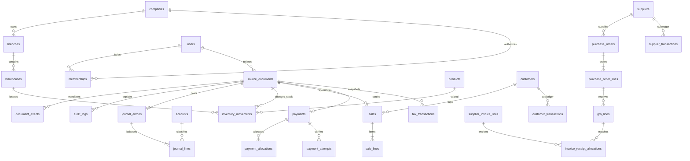

# Data model and integrity boundaries

Full executable target DDL is split into `001-core.sql` and `002-domains.sql`. `003-hardening.sql` adds core guards/runtime grants. `erd.mmd` is generated from all actual foreign keys, not a selective drawing. `data-dictionary.csv` is generated from PostgreSQL columns. Neither table presence nor an FK means the domain is functionally released.

## Key relationships

## Source-document supertype

Source carries common company/branch/date/currency, creator and state metadata. Domain tables carry specialized facts and a **unique composite FK** to source. Child lines derive creator of the document via the source, with row insertion actor also retained. Source ID is the referential source of all effects; operational type is stored on registry. Using a registry prevents orphan journal polymorphic IDs and permits full forward/reverse navigation. Historical source number and creator are immutable. Generic manual-journal drafts store a proposed line payload; posted lines are normalized with account FKs and checks.

Header states do not erase historical facts: reversal relation creates effective display status while original POSTED source remains untouched. Return line original-sale/receipt FKs preserve actual tax/cost origin. Role/permission assignments are relational configurable data. Company-role membership and all domain relationships use composite tenant keys.

## Authoritative and derived data

- Authoritative: posted journal lines, movement values/quantities, customer/supplier events, tax facts, payment/cash events, source/approval/audit history.
- Derived: customer/supplier balances, cash/bank balance, control totals, outstanding invoice amount, quantity remaining on order/receipt, inventory projection and shift expected cash.
- `inventory_balances` is a lockable rebuildable projection, not a public editing endpoint. Phase 1 runtime receives no domain write privileges, including this table.
- Draft totals are provisional; posting recalculates from trusted snapshots/rules. Historic amounts cannot be recalculated using today's rates.

## Precision and time

This first executable baseline deliberately fixes ledger monetary scale at **numeric(20,2)**, supported initial currencies KES/USD/EUR each scale 2; foundation API enables functional-currency journals only. Quantity/unit price use numeric(20,6), tax/FX rate numeric(20,10). Currency scale up to 4 is modeled, but currencies requiring another ledger scale must not be activated until a migration and full arithmetic suite are delivered. Use Decimal.js at precision 40 in services and decimal strings in transport. Never JavaScript arithmetic for ledger totals. UTC `timestamptz` for events, `date` for company-local business/tax/period date. Rate and cost snapshots are immutable.

## Constraint coverage

Core: FK/NOT NULL, unique sequence scope and document number, non-overlapping periods, source actor/state/origin guards, independent approval/posting, source/journal consistency, account company, currency/base checks, one-sided positive lines, deferred aggregate journal balance at commit, immutable journal/line/audit/event, source requires posted journal, idempotent source posting. Company RLS guards runtime reads/writes, with application membership/permission checks.

Domain baseline: all target tables, composite company foreign keys, positive quantity/payment checks, unique supplier invoice reference and provider receipt, line arithmetic, append-only movement/subledger/approval/cash/tax/allocation records, exact barcode uniqueness, one open terminal session, effective tax-range exclusions. **Pending before release:** domain cross-row consistency triggers (product/lot pairing, same-branch terminal/store pairing, header/line sums), domain-specific approval/revision policies (core journal policies are implemented), serial/expiry/quantity allocation invariants, movement/journal reconciliation guards, control-account-origin enforcement for domain posting, immutable configuration versions, currency settlement rules and full source/domain-type matching. Phase 1 runtime cannot write these domain tables; no claim that constraints alone finish the ERP.

## Index and search policy

Every target table has company/time index; FKs/search-heavy joins get additional indexes during domain implementation and query-plan testing. Barcode/SKU/product code and partner numbers are exact unique lookup keys. Names use pg_trgm. Audit/source history has company+actor+date access paths. Large report scans use date/company filters and cursor pagination; dynamic sort identifiers must be allow-listed. No unbounded lists for front-end selectors.

## Migration policy

Migrations execute under separate owner role and are ordered/checksummed by deployment tooling. Runtime is non-owner with RLS enabled and explicit grants. No implicit CASCADE delete of historical transactions. Additive schema changes first, backfill with attributed system documents where financial, then validate constraints, then enforce. Rebuild projections without changing authority. Seed is **development only** and creates sample companies/users/COA/open periods, not unexplained opening balances.

## Additive control schema, increment 0.2

Migration 004 adds permission delegations, append-only security events, atomic authentication rate buckets, encrypted authentication delivery outbox and immutable source revision archives; it extends existing memberships, roles, policy/step, decision and source tables without replacing posted history. Current exported application schema: **116 tables, 1,212 columns, 490 foreign keys**. `schema_migrations` is separate operational metadata and excluded from these application counts. See [control contract](05-phase1-controls.md).

Migration 005 adds version/creation/update metadata to branches, immutable identity checks, dependency-guarded deactivation and deferred runtime audit enforcement. No application tables were added; branch-created timestamps for legacy rows remain unknown rather than backdated.

Migration 006 adds company and warehouse versions/edit attribution, immutable identity/hierarchy guards and deferred runtime audit checks. A non-public fixed-search-path SECURITY DEFINER helper checks all current operational warehouse references without exposing unreleased tables to the runtime. Legacy warehouse creation timestamps stay NULL. Basic configuration is implemented, not inventory operations or safe operational closure.

Migration 007 adds `account_change_requests` and account version/edit/approval-link metadata. Composite company FKs bind proposals, parents, targets and applied accounts. Deferred constraints require account application and exact audit snapshots in the same transaction. Runtime writes cannot bypass independent approval. Legacy account-created timestamps stay NULL. See [COA workflow](09-chart-of-accounts-controls.md).

## Reviewed initial product registration (017)

Adds normalized product requests/proposed barcode and tax children plus dated tax profiles, and guards existing product/barcode/tax publication. Native SQL snapshots preserve20-digit decimal prices; exact-string authorized API projections do not mutate stored audits. Four new tables produce the132-table/1397-column/560-FK export. Independent immutable review, whole-interval reviewed tax coverage, publication identity and deferred complete audits are enforced. No stock runtime writes or migration018 exist yet. See inventory/product-master-next.md and inventory/weighted-average-contract.md.

## Released018 stock integrity

`inventory_adjustment_lines` and `inventory_valuations` bind immutable source proposals and revisioned valuation snapshots. Existing inventory movements now reference valuation and pool version; projections retain latest valued date. Native checks couple reviewed rule, original reversal source/movement/journal, movement, projection, exact audit and balanced GL. All001–018 migrations are immutable. Current export:134 tables,1426 columns,571 foreign keys. Table presence outside released workflows is not functional completion.

## Released019 customer masters

Initial independently reviewed registration uses `customer_change_requests`, existing `customers` and `customer_accounts`. Exact proposer/reviewer/policy metadata and native audits are immutable; deferred final-row guards reject post-BEFORE-trigger publication corruption. No `customer_transactions` row or balance is created. Current export:135 tables,1453 columns,579 foreign keys;001–019 applied and immutable.
